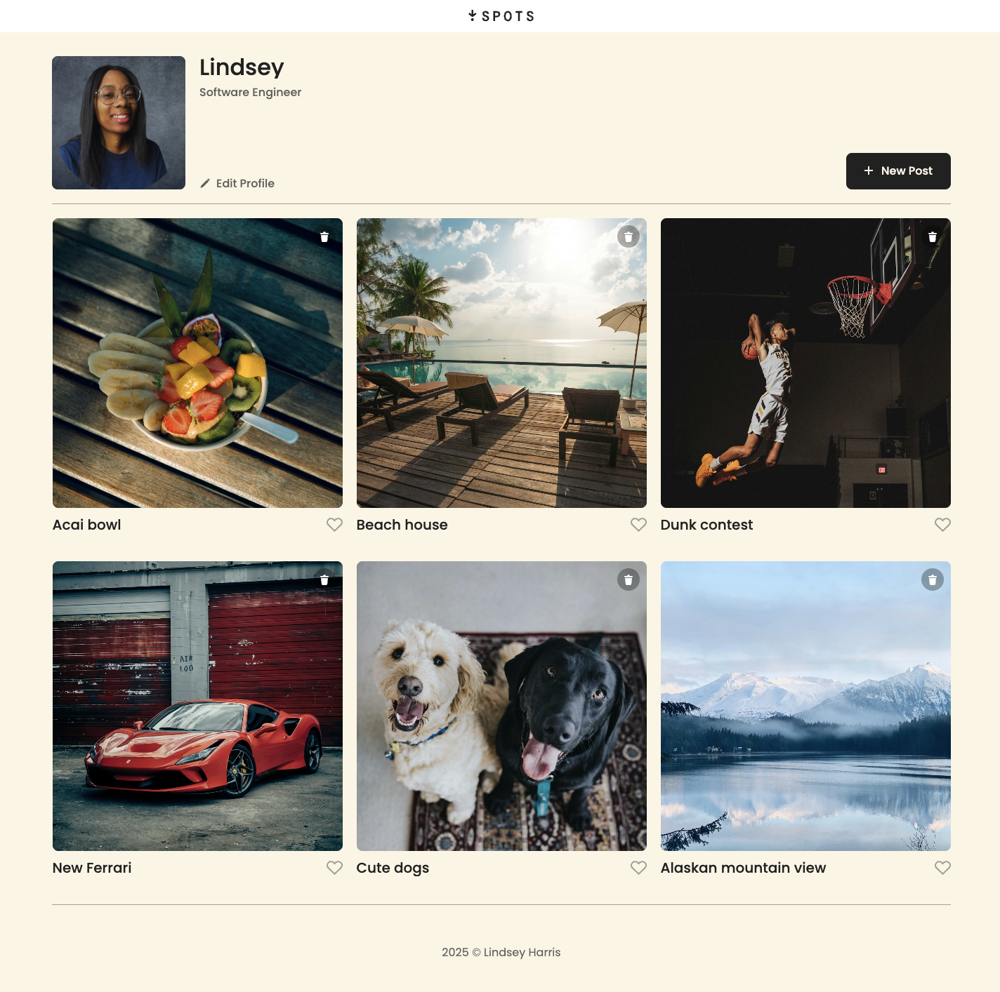
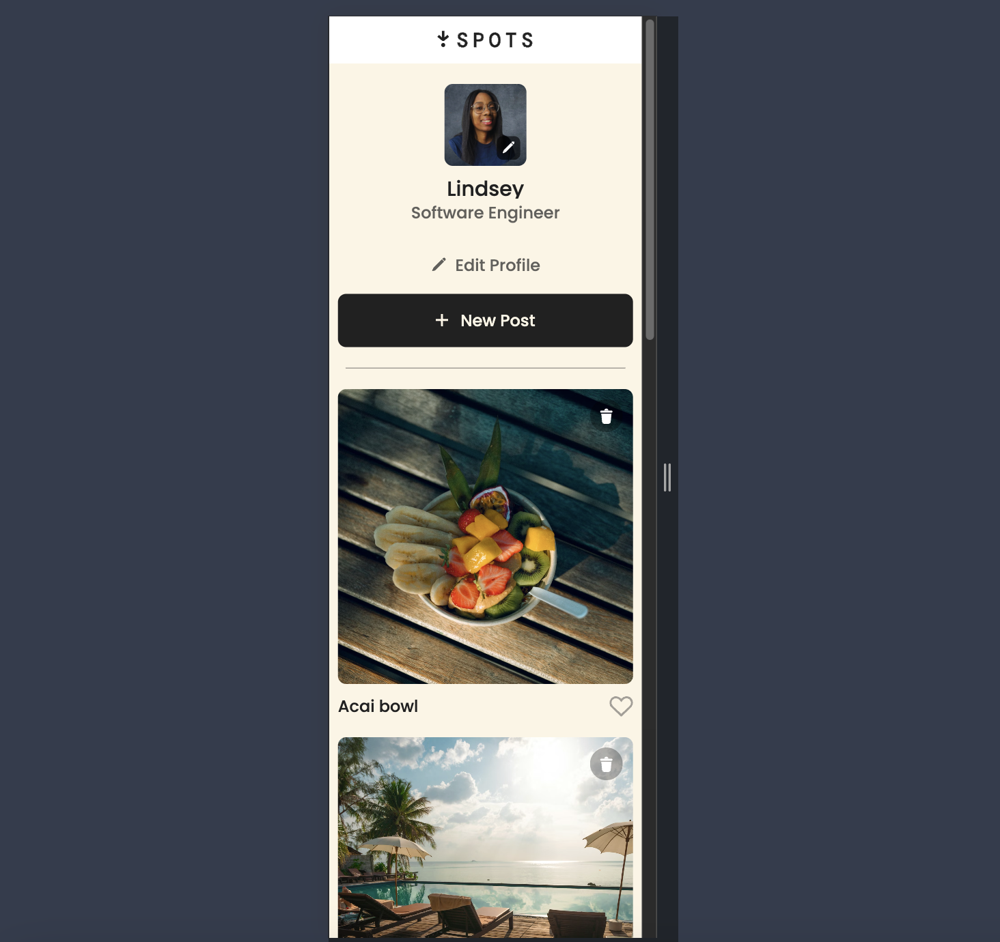
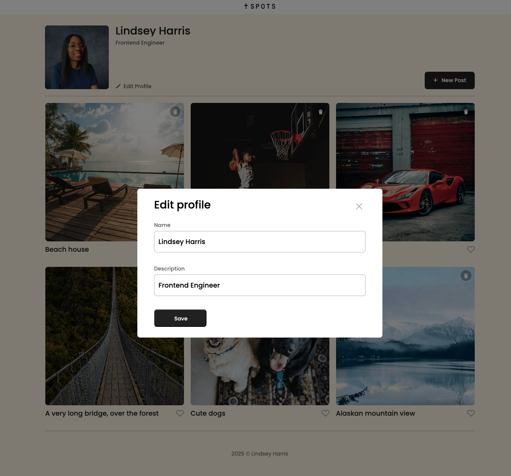
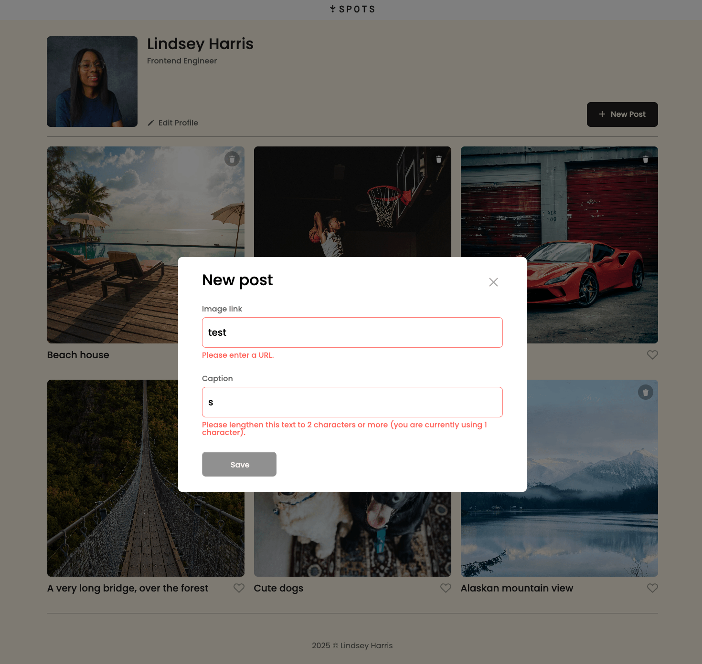
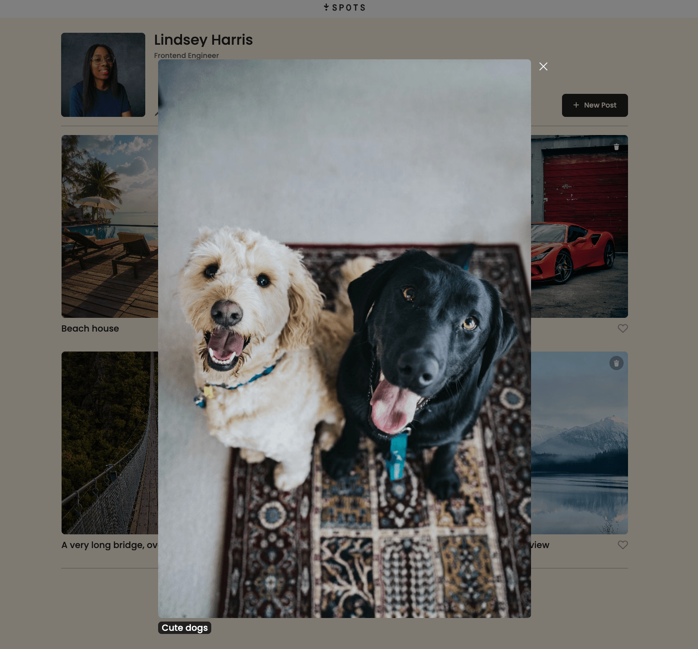

# Project 3: Spots — Social Media Image Sharing App

Spots is a fully responsive social media web application where users can share images, like posts, and personalize their profiles. The design was created in Figma and brought to life using semantic HTML, modern CSS, responsive web design principles, and JavaScript with REST API integration.

The app connects to a remote server to persist user data and post interactions. Users can:

## Features

- 📱 Fully responsive layout (desktop + mobile)
- 🔄 Full CRUD operations with a REST API
- Create (➕) new image posts via POST request (with persistent storage)
- Like (❤️) and unlike posts (with persistent state)
- Delete (🗑️) their own posts with server sync
- Edit (✏️) profile information
- Update their profile avatar 🖼️ via PATCH request
- Experience real-time UI feedback with loading states ⏳ ("Saving...", "Deleting...")

## Tech Stack

- Design: Figma (UI/UX mockups & wireframes)
- Build Tool: Vite
- Package Manager: npm
- Frontend: HTML5, CSS3, JavaScript
- API Integration: RESTful API (GET, POST, PATCH, PUT, DELETE)
- Responsive Design: Flexbox, Media Queries
- Version Control: Git & GitHub

## DEPLOYMENT

This webpage is deployed to Github pages.

## 🧪 Running the Project Locally

1. Clone the repository
2. Install dependencies:
   npm install
3. Start the development server:
   npm run dev
4. Build for production:
   npm run build

**🖥️ Live Site:** [Click here to View Project Demo](https://ln-harris.github.io/se_project_spots)

**Desktop View**
**📲 Mobile View**
**✏️ Edit Profile Modal**
**🔍 Form Validation Functions (Checks for errors)**
**📸 Preview Overlay**

## Project Pitch Video

Check out this live recorded demo 🎥 where I describe my
project and some challenges I faced while building it.

- [First Video](https://drive.google.com/file/d/1fbWxN0Vrc3jYohaYHboYqhdFqOxjTxoI/view?usp=sharing)
- [Second Video](https://www.loom.com/share/829037a07f334347b9493bdd83ca9ae4)

## Plan on improving:

1.  🌓 Add a light and dark theme for users toggle.
2.  💬 Add a comment button next to the like button for users to comment.
3.  ❤️ Add a Like counter next to the heart icon.
