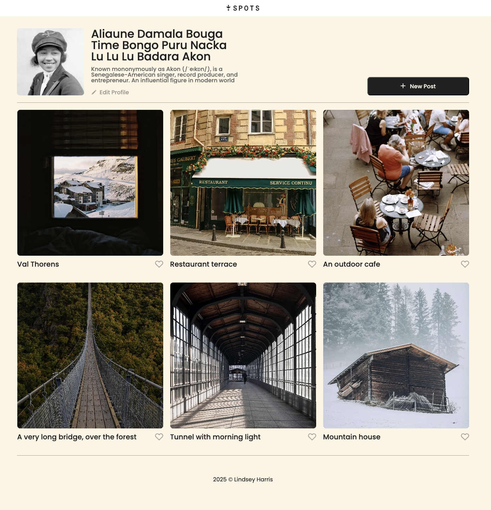

# Project 3: Spots — Social Image Sharing App

Spots is a responsive social media web app where users can share images, like posts, and personalize their profiles. The design was created in Figma and brought to life using HTML, CSS, and responsive web design principles. It includes a simple like (❤️) feature for engagement and editable profile bios for user customization. Optimized for both desktop and mobile with media queries.

## Tech Stack

- Design: Figma (UI/UX mockups & wireframes)

- Frontend: HTML, CSS, Media Queries

- Responsive Design: Built for desktop, tablet, and mobile

## DEPLOYMENT

This webpage is deployed to Github pages.

**🖥️ Live Site:** [View Project](https://ln-harris.github.io/se_project_spots)

**🎥 Live Recorded Demo:** [View Video]()

## Plan on improving:

- 🌓 Add a light and dark theme for users toggle.
- 💬 Add a comment button next to the like button for users to comment.
- 🔐 Demo Login System: Create a new login.html page with username + password form.

Create a Demo User credentials (e.g., demoUser / 1234)

On success → Logs you into Demo Profile.
